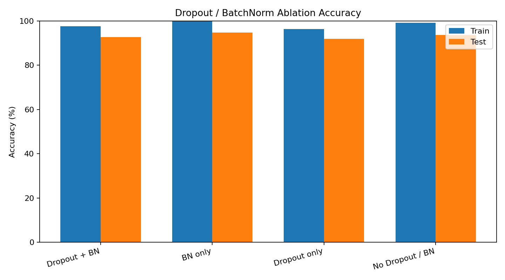
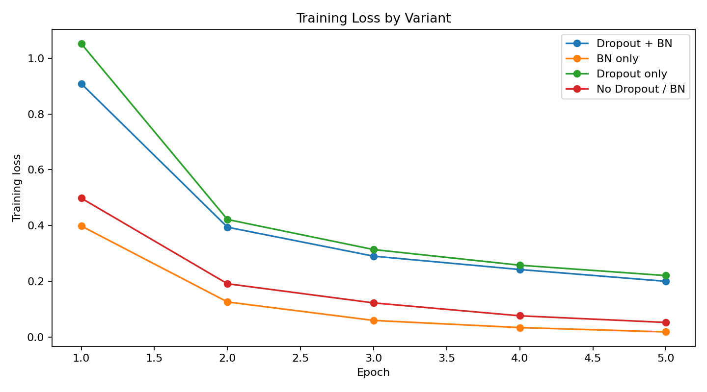

# Dropout / BatchNorm 제거 실험 비교

## 1. 실험 목적

이 실험은 손글씨 숫자 이미지인 MNIST를 분류하는 신경망에서 Dropout과 Batch Normalization이 학습 결과에 어떤 영향을 주는지 확인하기 위해 진행했다.

MNIST는 0부터 9까지의 손글씨 숫자 이미지 데이터셋이다. 모델은 28x28 크기의 숫자 이미지를 입력으로 받고, 이 이미지가 0부터 9 중 어떤 숫자인지 예측한다.

이번 실험에서 비교하려는 핵심 질문은 다음과 같다.

- Dropout을 제거하면 정확도가 어떻게 달라지는가?
- BatchNorm을 제거하면 정확도가 어떻게 달라지는가?
- 둘 다 제거하면 기본 모델보다 좋아지는가, 나빠지는가?
- 짧은 학습 조건에서 어떤 기법이 가장 효과적인가?

이를 확인하기 위해 네 가지 모델을 같은 조건에서 학습하고 테스트했다.

| 실험군 | Dropout | BatchNorm |
| --- | --- | --- |
| Dropout + BN | 사용 | 사용 |
| BN only | 제거 | 사용 |
| Dropout only | 사용 | 제거 |
| No Dropout / BN | 제거 | 제거 |

## 2. 핵심 요약

이번 실험에서는 BatchNorm만 사용한 모델이 가장 좋은 테스트 정확도를 보였다. 이유는 BatchNorm이 학습을 빠르고 안정적으로 만들어 주기 때문이다.

Dropout은 과적합을 막는 데 도움을 줄 수 있지만, 이번처럼 5 epoch만 학습한 짧은 실험에서는 모델이 충분히 배우기 전에 학습을 어렵게 만든 효과가 더 크게 나타났다. 그래서 Dropout을 쓴 모델들이 오히려 낮은 정확도를 보였다.

따라서 이번 결과는 "Dropout은 필요 없다"가 아니라, "이번 설정에서는 Dropout 효과를 보기에는 학습 시간이 짧고 dropout 비율이 강했다"라고 해석하는 것이 더 정확하다.

## 3. 주요 개념 설명

### Dropout

Dropout은 학습 중 일부 뉴런을 무작위로 꺼서 모델이 특정 뉴런에만 의존하지 않도록 만드는 방법이다. 쉽게 말하면 모델이 문제를 외우지 않고 여러 경로로 풀도록 일부러 학습을 어렵게 만드는 장치이다.

Dropout은 과적합을 줄이는 데 도움이 될 수 있다. 과적합은 모델이 학습 데이터는 매우 잘 맞히지만, 처음 보는 테스트 데이터에서는 성능이 떨어지는 현상을 말한다.

다만 Dropout은 학습 중 일부 정보를 일부러 버리기 때문에, 학습 초반에는 정확도가 느리게 올라갈 수 있다.

### Batch Normalization

Batch Normalization은 각 층으로 들어가는 값의 분포를 일정하게 맞춰 학습을 안정적으로 만드는 방법이다. 값의 범위가 너무 커지거나 작아지면 학습이 불안정해질 수 있는데, BatchNorm은 이를 완화한다.

일반적으로 BatchNorm은 학습 속도를 빠르게 하고, loss가 더 안정적으로 감소하도록 돕는다.

### Epoch

Epoch는 전체 학습 데이터를 모델이 몇 번 반복해서 학습했는지를 의미한다. 예를 들어 epoch가 5라면, 학습 데이터 전체를 5번 반복해서 본 것이다.

Dropout은 학습을 어렵게 만드는 기법이기 때문에 epoch가 너무 적으면 장점보다 단점이 먼저 나타날 수 있다.

### Train Accuracy와 Test Accuracy

Train accuracy는 모델이 학습에 사용한 데이터를 얼마나 잘 맞히는지 나타낸다. Test accuracy는 학습에 사용하지 않은 새로운 데이터를 얼마나 잘 맞히는지 나타낸다.

좋은 모델은 train accuracy만 높은 것이 아니라 test accuracy도 높아야 한다. train accuracy가 매우 높은데 test accuracy가 낮다면 과적합이 발생했을 가능성이 있다.

## 4. 실험 설정

| 항목 | 값 |
| --- | --- |
| 기준 브랜치 | `origin/dev` |
| 작업 브랜치 | `analysis/dropout-batchnorm-ablation` |
| 데이터셋 | MNIST |
| 학습 데이터 | 10,000개 |
| 테스트 데이터 | 2,000개 |
| Epoch | 5 |
| Batch size | 128 |
| Optimizer | Adam |
| Learning rate | 0.001 |
| Dropout ratio | 0.5 |
| Seed | 42 |
| 실행 환경 | Python 3.14.3, NumPy 2.4.6, Matplotlib 3.10.9 |

전체 MNIST 60,000개와 20 epoch로 돌리면 더 안정적인 결론을 낼 수 있지만, 이번 실험은 빠른 비교를 위해 부분 데이터셋으로 진행했다.

## 5. 테스트 진행 방법

테스트는 동일한 데이터, 동일한 모델 구조, 동일한 optimizer 설정에서 Dropout과 BatchNorm 사용 여부만 바꾸는 방식으로 진행했다. 비교 대상은 `Dropout + BN`, `BN only`, `Dropout only`, `No Dropout / BN` 네 가지이다.

실험 절차는 다음과 같다.

1. `load_mnist()`로 MNIST 데이터를 불러오고, 학습 데이터 10,000개와 테스트 데이터 2,000개만 사용한다.
2. 네 가지 실험군을 같은 random seed `42`로 초기화한다.
3. 각 실험군마다 `NeuralNetwork(use_dropout=..., use_batchnorm=...)` 옵션만 다르게 설정한다.
4. Adam optimizer와 learning rate `0.001`을 사용해 5 epoch 동안 학습한다.
5. 학습이 끝난 뒤 `evaluate()` 함수로 train accuracy와 test accuracy를 각각 계산한다.
6. 각 epoch의 loss history를 저장하고, 최종 loss와 accuracy를 CSV로 기록한다.
7. 저장된 결과를 바탕으로 accuracy 비교 막대그래프와 loss curve 그래프를 생성한다.

평가 시에는 `model.predict()`를 사용하므로 Dropout과 BatchNorm이 inference mode로 동작한다. 즉, Dropout은 무작위로 뉴런을 제거하지 않고, BatchNorm은 학습 중 누적한 running mean과 running variance를 사용한다.

## 6. 테스트 설계 이유

이 실험에서는 Dropout과 BatchNorm의 영향만 비교하기 위해 나머지 조건을 최대한 동일하게 맞췄다. 데이터 개수, 모델 구조, optimizer, learning rate, batch size, epoch를 모두 같게 두고 `use_dropout`, `use_batchnorm` 옵션만 바꿨다. 이렇게 해야 정확도 차이가 다른 설정 때문이 아니라 Dropout과 BatchNorm 사용 여부에서 나온 차이라고 해석할 수 있다.

네 가지 실험군을 둔 이유는 각 기법의 효과를 분리해서 보기 위해서이다. `Dropout + BN`은 두 기법을 모두 사용한 기준 모델이고, `BN only`는 Dropout을 제거했을 때의 변화를 보여준다. `Dropout only`는 BatchNorm을 제거했을 때의 변화를 보여주며, `No Dropout / BN`은 두 기법이 모두 없을 때의 기본 성능을 보여준다.

random seed를 `42`로 고정한 이유는 매번 다른 초기 가중치와 데이터 섞임 때문에 결과가 흔들리는 것을 줄이기 위해서이다. seed를 고정하면 네 모델이 가능한 한 비슷한 출발 조건에서 비교된다.

train accuracy와 test accuracy를 함께 측정한 이유는 단순히 학습 데이터를 잘 맞히는지보다, 처음 보는 데이터에도 잘 동작하는지가 더 중요하기 때문이다. train accuracy만 높고 test accuracy가 낮으면 과적합일 수 있다. Dropout은 과적합을 줄이는 목적이 있으므로 test accuracy와 train-test gap을 함께 보는 것이 필요하다.

loss curve를 시각화한 이유는 최종 정확도만으로는 학습 과정을 알 수 없기 때문이다. loss가 빠르게 줄어드는지, 천천히 줄어드는지, 특정 모델이 학습 초반에 불리한지 등을 그래프로 확인할 수 있다.

## 7. 실험 결과

| 실험군 | Train Accuracy | Test Accuracy | Final Loss | 파라미터 수 |
| --- | ---: | ---: | ---: | ---: |
| Dropout + BN | 97.64% | 92.70% | 0.1994 | 537,354 |
| BN only | 100.00% | 94.70% | 0.0179 | 537,354 |
| Dropout only | 96.27% | 91.85% | 0.2199 | 535,818 |
| No Dropout / BN | 99.21% | 93.60% | 0.0518 | 535,818 |

표를 읽는 방법은 다음과 같다.

- Train Accuracy가 높을수록 학습 데이터는 잘 맞힌 것이다.
- Test Accuracy가 높을수록 처음 보는 데이터도 잘 맞힌 것이다.
- Final Loss가 낮을수록 학습 마지막 시점의 오차가 작다.
- 파라미터 수는 모델이 학습하는 숫자의 개수이다. BatchNorm을 사용하면 gamma와 beta라는 추가 파라미터가 생겨 파라미터 수가 조금 증가한다.

## 8. 시각화

### Accuracy 비교



### Loss curve 비교



## 9. 분석

이번 조건에서는 `BN only` 모델이 테스트 정확도 94.70%로 가장 높았다. BatchNorm을 유지하고 Dropout만 제거했을 때 학습 loss가 가장 빠르게 낮아졌고, train accuracy도 100.00%까지 올라갔다.

Dropout을 사용하는 두 모델은 학습 정확도와 테스트 정확도가 모두 상대적으로 낮았다. 특히 5 epoch처럼 짧은 학습에서는 Dropout이 일부 뉴런을 무작위로 제거하기 때문에 학습 속도를 늦추는 효과가 더 크게 나타난 것으로 볼 수 있다.

BatchNorm을 제거한 `Dropout only` 모델은 테스트 정확도 91.85%로 가장 낮았다. 이는 BatchNorm이 학습 안정화와 수렴 속도 개선에 기여했음을 보여준다.

다만 `No Dropout / BN` 모델도 테스트 정확도 93.60%를 기록했다. 짧은 학습과 작은 데이터셋 조건에서는 정규화 기법이 항상 높은 정확도로 이어지지는 않았고, 추가 epoch를 사용하면 과적합 여부를 더 명확히 확인할 수 있다.

### BN only가 가장 높게 나온 이유

BatchNorm은 각 층의 입력 분포를 정규화하여 gradient 흐름을 안정화하고 학습 초반의 수렴 속도를 높이는 역할을 한다. 이번 실험은 5 epoch만 학습했기 때문에, 빠르게 loss를 낮추는 BatchNorm의 장점이 크게 나타났다.

반면 Dropout은 학습 중 일부 뉴런의 출력을 무작위로 0으로 만들어 모델이 특정 뉴런에 과도하게 의존하지 않도록 한다. 이 방식은 일반화 성능을 높이는 데 도움이 될 수 있지만, 짧은 학습에서는 학습 신호를 약하게 만들어 수렴을 늦출 수 있다. 특히 이번 실험의 `dropout_ratio=0.5`는 은닉층 출력의 절반을 제거하므로 비교적 강한 설정이다.

MNIST는 비교적 단순한 이미지 분류 문제이기 때문에 강한 Dropout 없이도 높은 정확도에 도달할 수 있다. 따라서 이번 조건에서는 과적합 방지 효과보다 빠른 수렴 효과가 더 중요하게 작용했고, 그 결과 `BN only` 모델이 가장 높은 테스트 정확도를 기록했다.

또한 Dropout과 BatchNorm을 함께 사용할 때 항상 성능이 좋아지는 것은 아니다. Dropout은 학습 중 activation 분포를 무작위로 바꾸고, BatchNorm은 batch 통계를 기반으로 running mean과 running variance를 추정한다. 설정에 따라 두 기법이 서로의 통계 추정을 방해할 수 있으므로, 조합 성능은 epoch 수와 dropout 비율에 따라 달라질 수 있다.

## 10. 실험의 한계

이번 실험은 빠른 비교를 위해 학습 데이터 10,000개, 테스트 데이터 2,000개, 5 epoch만 사용했다. 따라서 전체 MNIST 데이터셋을 충분히 오래 학습했을 때의 최종 성능과는 다를 수 있다.

또한 random seed를 하나만 사용했기 때문에 초기 가중치나 데이터 섞임에 따른 결과 변동을 완전히 확인하지는 못했다. 더 엄밀한 비교를 위해서는 여러 seed로 반복 실험한 뒤 평균 정확도와 표준편차를 함께 제시하는 것이 좋다.

따라서 이번 결과는 "5 epoch의 빠른 비교 실험에서는 BN only가 가장 높았다"로 해석하는 것이 적절하며, 모든 조건에서 항상 BN only가 가장 좋다는 결론으로 일반화하면 안 된다.

## 11. 추가 실험 방향

현재 결과만으로 `Dropout + BN` 조합이 의미 없다고 결론 내리기는 어렵다. Dropout은 초반 수렴을 늦추는 대신 장기 학습에서 과적합을 줄이는 목적이 강하므로, 더 많은 epoch와 낮은 dropout 비율을 함께 비교해야 한다.

추천 실험 범위는 다음과 같다.

| 목적 | 추천 설정 |
| --- | --- |
| 빠른 재확인 | `epochs=10`, `dropout_ratio=0.5` |
| 리포트용 기본 비교 | `epochs=20`, `dropout_ratio=0.5` |
| Dropout 효과 재평가 | `epochs=20`, `dropout_ratio=0.2` |
| 과적합 차이 확인 | `epochs=30`, `dropout_ratio=0.2` |

특히 `Dropout + BN` 모델을 더 공정하게 평가하려면 `dropout_ratio=0.2`도 함께 실험하는 것이 좋다. 0.5는 MNIST의 작은 fully connected network에는 강하게 작용할 수 있기 때문이다.

추가 실험에서는 최종 test accuracy만 보는 것보다 train accuracy와 test accuracy의 차이를 함께 확인해야 한다. `BN only`가 train accuracy 100%에 가깝지만 test accuracy가 정체된다면 과적합 가능성이 있고, `Dropout + BN`이 train accuracy는 낮더라도 test accuracy와의 차이가 작다면 일반화 측면에서 의미가 있다.

## 12. 결론

현재 실험 조건에서는 BatchNorm의 효과가 Dropout보다 더 뚜렷했다. Dropout은 과적합을 줄이는 목적의 정규화 기법이지만, 이번처럼 5 epoch만 학습한 경우에는 오히려 수렴을 늦춰 테스트 정확도가 낮게 나타났다.

최종 리포트에서는 전체 데이터셋 또는 더 많은 epoch로 다시 실험하여 `BN only` 모델이 계속 가장 좋은지, Dropout이 장기 학습에서 과적합을 줄이는지 추가 확인하는 것이 좋다.

## 13. 재현 방법

```powershell
python analysis\dropout_batchnorm_ablation.py --epochs 5 --train-size 10000 --test-size 2000 --batch-size 128 --seed 42
```

실험 결과 CSV는 `analysis/dropout_batchnorm_ablation_results.csv`에 저장되고, 그래프 이미지는 `analysis/plots/`에 저장된다.

추가 실험 예시는 다음과 같다.

```powershell
python analysis\dropout_batchnorm_ablation.py --epochs 20 --train-size 60000 --test-size 10000 --batch-size 128 --dropout-ratio 0.5 --seed 42
python analysis\dropout_batchnorm_ablation.py --epochs 20 --train-size 60000 --test-size 10000 --batch-size 128 --dropout-ratio 0.2 --seed 42
```
