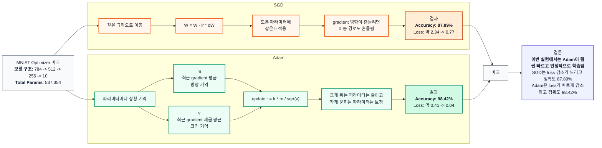

# MNIST 손글씨 인식 과제 보고서

## 0. 반·팀원

| 항목     | 내용                 |
| -------- | -------------------- |
| **반**   | (302반)         |
| **팀원** | (이시원, 이지섭, 이현성, 양은열) |

---

## 1. 실험 목적

MNIST 10-class 분류를 **NumPy만으로 구현한 신경망**으로 수행하고, 테스트 정확도와 학습 과정을 보고.

---

## 2. 모델 구조

| 구분       | 내용                                                                               |
| ---------- | ---------------------------------------------------------------------------------- |
| **입력**   | 784 (28×28 픽셀, 0~1 정규화)                                                       |
| **은닉층** | Affine → BatchNorm → ReLU → Dropout 순으로 구성 (층 수·뉴런 수는 실험에 맞게 기입) |
| **출력**   | Affine(→10) + Softmax                                                              |

**(2층 은닉):**  
입력 784 → Affine(512) → BatchNorm → ReLU → Dropout → Affine(256) → BatchNorm → ReLU → Dropout → Affine(10) → Softmax

---

## 3. 학습 설정

| 항목               | 값          |
| ------------------ | ----------- |
| 옵티마이저         | Adam        |
| 학습률 (lr)        | 0.001       |
| epochs             | 20          |
| batch_size         | 128         |
| Dropout 비율       | 0.5         |
| BatchNorm momentum | 0.9         |
| 가중치 초기화      | He (bias 0) |

---

## 4. 실험 환경

- Python 3.11, NumPy, Matplotlib, Local
- 학습 소요 시간: (약 2분)

---

## 5. 결과

| 항목               | 값              |
| ------------------ | --------------- |
| **테스트 정확도**  | (98.44%)    |
| **총 파라미터 수** | (537,354) |

---

## 6. 추가 실험 및 벤치마크

### 6-1 Activation Function 비교

| Run        | Activation    | 변경점                             | Test Accuracy | Total Params |
| ---------- | ------------- | ---------------------------------- | ------------: | -----------: |
| Baseline-A | ReLU          | 기준 모델                          |        98.44% |      537,354 |
| Step-A     | Step Function | 은닉층 activation만 Step으로 변경  |        77.29% |      537,354 |
| Sigmoid-A  | Sigmoid       | 은닉층 activation만 Sigmoid로 변경 |        97.79% |      537,354 |

### 6-2 Gradient Vanishing 진단 기록

| Activation |  dW1 L2 norm |  dW2 L2 norm |  dW3 L2 norm | 관찰 메모                                  |
| ---------- | -----------: | -----------: | -----------: | ------------------------------------------ |
| ReLU       | 2.950720e+00 | 2.069579e+00 | 1.804833e+00 | 기준 gradient 흐름                         |
| Sigmoid    | 9.426143e-01 | 7.321449e-01 | 1.546690e+00 | `W1`, `W2` gradient가 ReLU보다 작게 관찰됨 |

### 6-3. 하이퍼파라미터 변경 실험

### Learning Rate 변경 실험

| Learning Rate | Test Accuracy | 비고                       |
| ------------: | ------------: | -------------------------- |
|       0.00001 |        92.67% | 너무 작아 학습 속도가 느림 |
|         0.001 |        98.41% | 기본값, 안정적 수렴        |
|         0.005 |        98.47% | 가장 높은 정확도           |
|         0.009 |        98.39% | 기본값과 유사한 성능       |
|           0.1 |        97.43% | 값이 커져 약간 불안정      |
|           1.0 |          9.8% | 너무 커서 학습 실패        |

### 6-4 Optimizer 비교: SGD vs Adam

### 6-5 Dropout / BatchNorm 제거 실험 비교

### 실험 결과

| 실험군 | Train Accuracy | Test Accuracy | Final Loss | 파라미터 수 |
| --- | ---: | ---: | ---: | ---: |
| Dropout + BN | 99.81% | 98.48% | 0.0431 | 537,354 |
| BN only | 99.96% | 98.33% | 0.0062 | 537,354 |
| Dropout only | 99.77% | 98.36% | 0.0389 | 535,818 |
| No Dropout / BN | 99.82% | 97.98% | 0.0077 | 535,818 |

### 손실 커브

### 결론

현재 실험 조건에서는 `Dropout + BN` 모델이 가장 높은 테스트 정확도를 보였다. BatchNorm은 학습을 안정화하고, Dropout은 과적합을 줄이는 역할을 하므로 두 기법을 함께 사용했을 때 가장 좋은 일반화 성능을 얻은 것으로 해석할 수 있다.
