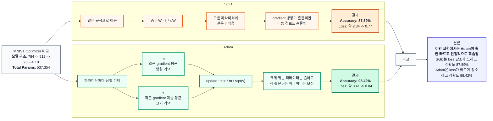

# MNIST 손글씨 인식 과제 보고서

## 0. 반·팀원

| 항목     | 내용                 |
| -------- | -------------------- |
| **반**   | (예: AI 1반)         |
| **팀원** | (예: 홍길동, 김철수) |

---

## 1. 실험 목적

MNIST 10-class 분류를 **NumPy만으로 구현한 신경망**으로 수행하고, 테스트 정확도와 학습 과정을 보고합니다.

---

## 2. 모델 구조

| 구분       | 내용                                                                               |
| ---------- | ---------------------------------------------------------------------------------- |
| **입력**   | 784 (28×28 픽셀, 0~1 정규화)                                                       |
| **은닉층** | Affine → BatchNorm → ReLU → Dropout 순으로 구성 (층 수·뉴런 수는 실험에 맞게 기입) |
| **출력**   | Affine(→10) + Softmax                                                              |

**예시 (2층 은닉):**  
입력 784 → Affine(512) → BatchNorm → ReLU → Dropout → Affine(256) → BatchNorm → ReLU → Dropout → Affine(10) → Softmax

---

## 3. 학습 설정

| 항목               | 값          |
| ------------------ | ----------- |
| 옵티마이저         | Adam        |
| 학습률 (lr)        | 0.001       |
| epochs             | 20          |
| batch_size         | 128         |
| Dropout 비율       | 0.5         |
| BatchNorm momentum | 0.9         |
| 가중치 초기화      | He (bias 0) |

---

## 4. 실험 환경

- Python 3.11, NumPy, Matplotlib
- 학습 소요 시간: (예: CPU 기준 약 2~3분)

---

## 5. 결과

| 항목               | 값              |
| ------------------ | --------------- |
| **테스트 정확도**  | (예: 97.23%)    |
| **총 파라미터 수** | (예: 1,199,882) |

---

## 6. 추가 실험 및 벤치마크

### 6.1 Activation Function 비교

| Run        | Activation    | 변경점                             | Test Accuracy | Total Params |
| ---------- | ------------- | ---------------------------------- | ------------: | -----------: |
| Baseline-A | ReLU          | 기준 모델                          |        98.44% |      537,354 |
| Step-A     | Step Function | 은닉층 activation만 Step으로 변경  |        77.29% |      537,354 |
| Sigmoid-A  | Sigmoid       | 은닉층 activation만 Sigmoid로 변경 |        97.79% |      537,354 |

Step Function은 입력을 0 또는 1로만 변환하는 계단 함수이다. Forward 단계에서는 값을 단순한 binary activation으로 바꾸지만, backward 단계에서는 대부분의 구간에서 gradient가 0이 된다. 이번 구현에서도 Step Function의 backward를 `np.zeros_like(dout)`로 두었기 때문에, `Affine1`, `BatchNorm1`, `Affine2`, `BatchNorm2` 쪽으로 gradient가 거의 전달되지 않는다.

그 결과 마지막 출력층인 `Affine3`는 업데이트될 수 있지만, 앞쪽 은닉층은 feature extractor로서 충분히 학습되지 못한다. Step-A의 정확도가 77.29%로 ReLU baseline보다 크게 낮게 나온 이유는 이 gradient 차단 때문으로 볼 수 있다.

Sigmoid는 Step Function과 달리 미분 가능하므로 앞쪽 은닉층까지 gradient가 전달된다. 하지만 `sigmoid'(x) = sigmoid(x) * (1 - sigmoid(x))`이고 최대값이 0.25이기 때문에, 여러 층을 거치면서 gradient가 작아질 수 있다. 또한 입력값의 절댓값이 커지면 Sigmoid 출력이 0 또는 1에 가까워져 gradient가 거의 0이 되는 포화 문제가 발생한다.

이번 실험에서 Sigmoid-A는 97.79%를 기록하여 Step-A보다 훨씬 안정적으로 학습되었지만, ReLU baseline인 98.44%보다는 낮았다. 이는 Sigmoid가 학습은 가능하지만 ReLU보다 gradient 흐름이 약해질 수 있음을 보여준다.

### 6.2 Gradient Vanishing 진단 기록

이 진단 실험은 전체 학습을 다시 수행하지 않고, 같은 mini-batch 하나에서 ReLU 모델과 Sigmoid 모델을 각각 한 번 forward/backward 한 뒤 layer별 `dW`의 L2 norm을 비교합니다. Dropout은 랜덤 mask 영향을 줄이기 위해 끄고, BatchNorm은 현재 모델 구조와 맞추기 위해 유지합니다.

| Activation |  dW1 L2 norm |  dW2 L2 norm |  dW3 L2 norm | 관찰 메모                                  |
| ---------- | -----------: | -----------: | -----------: | ------------------------------------------ |
| ReLU       | 2.950720e+00 | 2.069579e+00 | 1.804833e+00 | 기준 gradient 흐름                         |
| Sigmoid    | 9.426143e-01 | 7.321449e-01 | 1.546690e+00 | `W1`, `W2` gradient가 ReLU보다 작게 관찰됨 |

Sigmoid는 Step Function과 달리 미분 가능하므로 gradient가 완전히 끊기지는 않습니다. 다만 `sigmoid'(x) = sigmoid(x) * (1 - sigmoid(x)) <= 0.25`이기 때문에 여러 층을 지나며 gradient가 작아질 수 있습니다. 현재 모델은 은닉층이 2개이고 BatchNorm을 사용하므로 gradient vanishing이 완화되어 극단적으로 보이지 않을 수 있으며, 이 경우에는 ReLU와 Sigmoid의 gradient norm 비율과 loss curve를 함께 해석합니다.

이번 진단에서는 Sigmoid의 `W1` gradient가 ReLU 대비 약 31.9%, `W2` gradient가 약 35.4% 수준으로 작았습니다. 반면 `W3`는 ReLU 대비 약 85.7% 수준으로 비교적 덜 줄었습니다. 이는 Sigmoid가 출력층 가까운 곳보다 앞쪽 은닉층에서 gradient를 더 약하게 전달할 수 있음을 보여줍니다.

## 6-3. 하이퍼파라미터 변경 실험

### Learning Rate 변경 실험

Adam optimizer의 learning rate를 변경하면서 테스트 정확도 변화를 비교하였다.  
Learning rate는 모델이 한 번 업데이트될 때 가중치를 얼마나 크게 수정할지를 결정하는 하이퍼파라미터이다.

| Learning Rate | Test Accuracy | 비고                       |
| ------------: | ------------: | -------------------------- |
|       0.00001 |        92.67% | 너무 작아 학습 속도가 느림 |
|         0.001 |        98.41% | 기본값, 안정적 수렴        |
|         0.005 |        98.47% | 가장 높은 정확도           |
|         0.009 |        98.39% | 기본값과 유사한 성능       |
|           0.1 |        97.43% | 값이 커져 약간 불안정      |
|           1.0 |          9.8% | 너무 커서 학습 실패        |

실험 결과 `lr=0.005`에서 가장 높은 테스트 정확도인 **98.47%**를 기록하였다.  
`lr=0.00001`은 learning rate가 너무 작아 가중치가 매우 조금씩만 업데이트되었고, 정해진 epoch 안에서 충분히 학습하지 못해 정확도가 낮게 나타난 것으로 볼 수 있다.

반면 `lr=0.1`은 learning rate가 너무 커서 가중치가 한 번에 크게 수정되었고, 이로 인해 학습이 다소 불안정해져 기본값보다 정확도가 낮아진 것으로 해석할 수 있다.

따라서 본 실험에서는 `0.001 ~ 0.009` 범위의 learning rate가 비교적 안정적인 성능을 보였으며, 그중 `lr=0.005`가 가장 좋은 결과를 보였다.

### 6-4 Optimizer 비교: SGD vs Adam

### 6-5 Dropout / BatchNorm 제거 실험 비교

## 1. 핵심 요약

이 실험은 손글씨 숫자 이미지인 MNIST를 분류하는 신경망에서 Dropout과 Batch Normalization이 학습 결과에 어떤 영향을 주는지 확인하기 위해 진행했다.

이번 실험에서는 Dropout과 BatchNorm을 모두 사용한 모델이 테스트 정확도 98.48%로 가장 높았다. 두 기법을 함께 사용했을 때 학습 안정화와 과적합 완화 효과가 같이 작용한 것으로 볼 수 있다.

BatchNorm만 사용한 모델은 train accuracy가 99.96%로 가장 높았지만 test accuracy는 98.33%였다. 이는 학습 데이터에는 매우 잘 맞았지만, 테스트 데이터 기준으로는 Dropout을 함께 사용한 모델보다 약간 낮았다.

따라서 이번 결과는 "충분한 데이터와 20 epoch 조건에서는 Dropout + BatchNorm 조합이 가장 좋은 일반화 성능을 보였다"라고 해석할 수 있다.

## 2. 실험 결과

| 실험군 | Train Accuracy | Test Accuracy | Final Loss | 파라미터 수 |
| --- | ---: | ---: | ---: | ---: |
| Dropout + BN | 99.81% | 98.48% | 0.0431 | 537,354 |
| BN only | 99.96% | 98.33% | 0.0062 | 537,354 |
| Dropout only | 99.77% | 98.36% | 0.0389 | 535,818 |
| No Dropout / BN | 99.82% | 97.98% | 0.0077 | 535,818 |

## 3. 결론

현재 실험 조건에서는 `Dropout + BN` 모델이 가장 높은 테스트 정확도를 보였다. BatchNorm은 학습을 안정화하고, Dropout은 과적합을 줄이는 역할을 하므로 두 기법을 함께 사용했을 때 가장 좋은 일반화 성능을 얻은 것으로 해석할 수 있다.

### 손실 커브

- 학습 곡선: (그래프 이미지를 붙이거나, 예: "Epoch 1 Loss 0.42 → Epoch 20 Loss 0.06 수렴" 같이 수치로 요약)

---

## 6. 회고

- 손실 수렴 여부, 과적합/과소적합 여부
- 구조·학습률·Dropout 등 변경 시도와 그 결과 (있다면 간단히)
