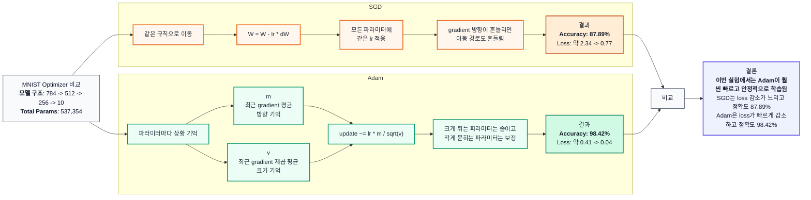

# SGD vs Adam 비교

```mermaid
flowchart LR
    START["MNIST Optimizer 비교<br/><b>모델 구조</b>: 784 -> 512 -> 256 -> 10<br/><b>Total Params</b>: 537,354"]

    START --> SGD
    START --> ADAM

    subgraph LEFT["SGD"]
        direction TB
        SGD["같은 규칙으로 이동"]
        SFORM["W = W - lr * dW"]
        SRULE["모든 파라미터에<br/>같은 lr 적용"]
        SPATH["gradient 방향이 흔들리면<br/>이동 경로도 흔들림"]
        SRESULT["결과<br/><b>Accuracy: 87.89%</b><br/>Loss: 약 2.34 -> 0.77"]

        SGD --> SFORM --> SRULE --> SPATH --> SRESULT
    end

    subgraph RIGHT["Adam"]
        direction TB
        ADAM["파라미터마다 상황 기억"]
        M["m<br/>최근 gradient 평균<br/>방향 기억"]
        V["v<br/>최근 gradient 제곱 평균<br/>크기 기억"]
        AFORM["update ~= lr * m / sqrt(v)"]
        ARULE["크게 튀는 파라미터는 줄이고<br/>작게 묻히는 파라미터는 보정"]
        ARESULT["결과<br/><b>Accuracy: 98.42%</b><br/>Loss: 약 0.41 -> 0.04"]

        ADAM --> M
        ADAM --> V
        M --> AFORM
        V --> AFORM
        AFORM --> ARULE --> ARESULT
    end

    SRESULT --> COMPARE["비교"]
    ARESULT --> COMPARE

    COMPARE --> CONCLUSION["결론<br/><b>이번 실험에서는 Adam이 훨씬 빠르고 안정적으로 학습됨</b><br/>SGD는 loss 감소가 느리고 정확도 87.89%<br/>Adam은 loss가 빠르게 감소하고 정확도 98.42%"]

    classDef base fill:#f8fafc,stroke:#334155,stroke-width:1px,color:#0f172a;
    classDef sgd fill:#fff7ed,stroke:#ea580c,stroke-width:2px,color:#1f2937;
    classDef adam fill:#ecfdf5,stroke:#059669,stroke-width:2px,color:#1f2937;
    classDef metricS fill:#ffedd5,stroke:#c2410c,stroke-width:2px,color:#111827;
    classDef metricA fill:#d1fae5,stroke:#047857,stroke-width:2px,color:#111827;
    classDef conclusion fill:#eef2ff,stroke:#4f46e5,stroke-width:2px,color:#111827;

    class START,COMPARE base;
    class SGD,SFORM,SRULE,SPATH sgd;
    class ADAM,M,V,AFORM,ARULE adam;
    class SRESULT metricS;
    class ARESULT metricA;
    class CONCLUSION conclusion;
```
